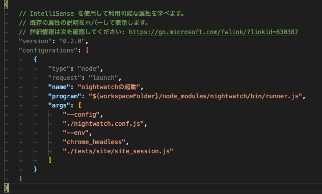

## テスト手順

- テストを実施する(方法1)

  ```
  make
  ```

- テストを実施する(方法2)

  ```
  npm run test
  ```

- テストを実施する(方法3)

  ```
  $(npm bin)/nightwatch
  ```

### テスト結果

reportsに出力される

## デバッグ方法

- WebStorm

[参考](https://github.com/nightwatchjs/nightwatch/wiki/Debugging-Nightwatch-tests-in-WebStorm)


- vscode


